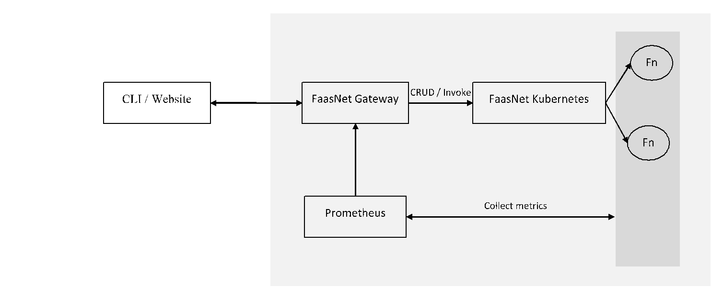

# Introduction

FaasNet architecture is made of five blocks :

* **Function** : One function can be deployed into one or more Kubernetes PODs.
* **Gateway** : Expose operations to the portal and CLI. They can be used to perform administrative tasks on `function`, `serverless workflow` and `EventMesh server`.
* **Monitoring** : Prometheus product is configured by default to monitor published functions.
* **Portal/CLI** : Used by developers to perform administrative tasks.
* **Kubernetes** : Execute operations on Kubernetes like : deploying / removing functions.

