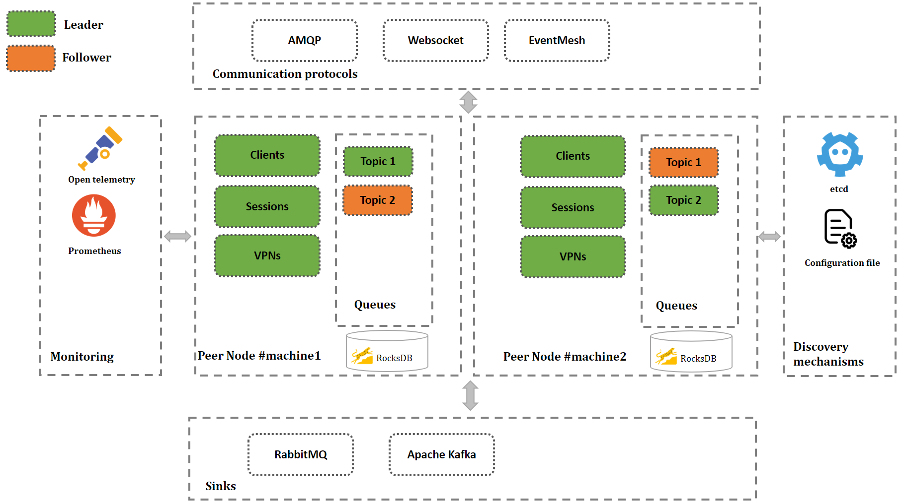

# Architecture

The EventMesh architecture is made of five blocks :
* **Peer Node** : An EventMesh cluster is made of two or more peers.
* **Monitoring** : Each EventMesh Peer expose different OpenTelemetry metrics.
* **Commnication protocols** : Client can choose one protocol to communicate with the EventMesh cluster.
* **Discovery mechanisms** : EventMesh cluster is formed by using one of the discovery mechanism.
* **Sinks** : Consume records and streams them to the EventMesh cluster.

