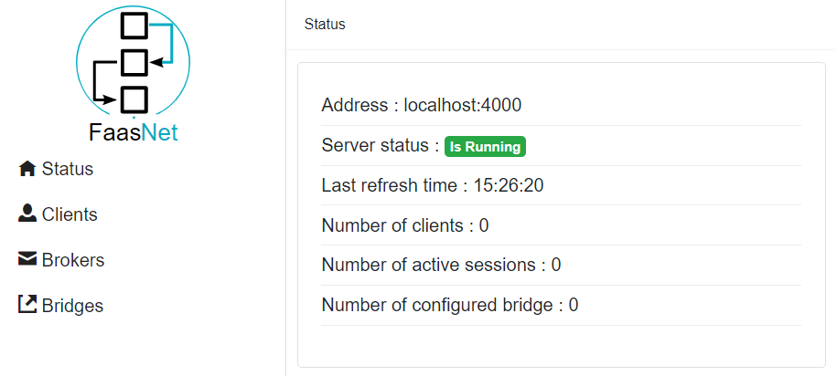

# Portal

A portal can be installed to administrate the EventMesh Server.

```
mkdir QuickStart
cd QuickStart

mkdir src
cd src

dotnet new evtmeshinmemui -n EventMeshServer
```

The following files will be created :

* *Program.cs* and *Startup.cs* : application entry point.
* *Pages* : Razor pages.

In case the Visual Studio Support is needed, a solution can be created :

```
cd ..
dotnet new sln -n QuickStart
```

Add the EventMesh server into the solution :

```
dotnet sln add ./src/EventMeshServer/EventMeshServer.csproj
```

Run the EventMesh server and browse the URL : [http://localhost:5001](http://localhost:5001).

```
cd src/EventMeshServer
dotnet run --urls=http://localhost:5001
```

The following UI is displayed. It contains four options :

* *Status* : Display the status of the EventMesh server.
* *Clients* : Display all the clients.
* *Brokers* : Display all the configured message brokers.
* *Bridges* : Display all the bridges.

