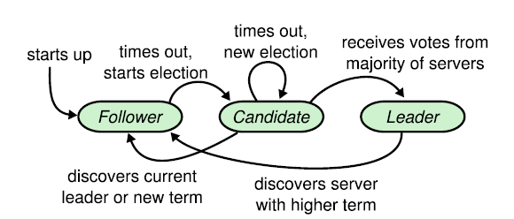

# Raft consensus

Raft consensus algorithm is used to build resilient, fault-tolerant, strongly-consistent distributed systems.

Applications like Apache Kafka are using Raft Consensus algorithm for both leader election and data replication.
Instead of having all the data stored in one Peer, they are duplicated among two or more Peers.

The algorithm is widely used :
* CockroachDB uses raft in the Replication layer.
* MongoDB uses a variant of Raft in the replication set.

In the context of Raft Consensus, a Peer can have one of the following status :
* Follower : issue no requests but simply respond to request from leaders and candidates.
* Candidate : during the election process, ask to other Peers to become the leader. Candidate becomes the leader when it receives votes from majority of servers.
* Leader : handle all client requests.



## Quick start

In this tutorial, we are going to explain how to use the C# library to have an up and running RAFT Consensus server.

Open a command prompt and create a console application.

```
mkdir QuickStart
cd QuickStart

mkdir src
cd src

dotnet new console -n RaftConsensusServer
```

Install the Nuget package `FaasNet.RaftConsensus.Core`.

```
cd RaftConsensusServer

dotnet add package FaasNet.RaftConsensus.Core
```

Add the console application into the Visual Studio Solution.

```
cd ../..
dotnet new sln -n QuickStart
dotnet sln add ./src/RaftConsensusServer/RaftConsensusServer.csproj
```

Open the Visual Studio Solution and edit the `Program.cs` file.

Add a new procedure `LaunchRaftConsensusPeer(ConcurrentBag<ClusterPeer> clusterPeers, string nodeName, int port)`, it will be used to start one RAFT Consensus peer.

```
private static IPeerHost LaunchRaftConsensusPeer(ConcurrentBag<ClusterPeer> clusterPeers, string nodeName = "node1", int port = 5001)
{
    var path = Path.GetDirectoryName(Assembly.GetExecutingAssembly().Location);
    var peerHost = PeerHostFactory.NewUnstructured(o => {
        o.Port = port;
    }, clusterPeers)
        .UseUDPTransport()
        .AddRaftConsensus(o =>
        {
            o.ConfigurationDirectoryPath = Path.Combine(path, nodeName);
            o.LeaderCallback = () =>
            {
                Console.WriteLine("There a is a leader");
            };
        })
        .Build();
    peerHost.Start();
    return peerHost;
}
```

Add a new procedure `AddLogEntry(int port)`, it will be used to add a log.

```
private static async void AddLogEntry(int port)
{
    using (var raftConsensusClient = new UDPRaftConsensusClient("localhost", port))
        await raftConsensusClient.AppendEntry(Encoding.UTF8.GetBytes("value"), CancellationToken.None);
}
```

Add a new procedure `DisplayLogs(int port)`, it will be used to display all the logs.

```
private static async void DisplayLogs(int port)
{
    using (var raftConsensusClient = new UDPRaftConsensusClient("localhost", port))
    {
        var result = await raftConsensusClient.GetLogs(1, CancellationToken.None);
        foreach(var log in result.Entries)
        {
            Console.WriteLine($"Index {log.Index}");
            Console.WriteLine($"Term {log.Term}");
        }
    }
}
```

Add the following code to add two peers, publish one log and display all the logs.

```
var firstPeer = LaunchRaftConsensusPeer(new ConcurrentBag<ClusterPeer> { new ClusterPeer("localhost", 5002) }, "node1", 5001);
var secondPeer = LaunchRaftConsensusPeer(new ConcurrentBag<ClusterPeer> { new ClusterPeer("localhost", 5001) }, "node2", 5002);
Console.WriteLine("Press any key to add an entry");
Console.ReadLine();
AddLogEntry(5002);
Console.WriteLine("Press any key to add an entry");
Console.ReadLine();
AddLogEntry(5002);
Console.WriteLine("Press any key to get logs of Peer 5001");
Console.ReadLine();
DisplayLogs(5001);
Console.WriteLine("Press any key to get logs of Peer 5002");
Console.ReadLine();
DisplayLogs(5002);
```