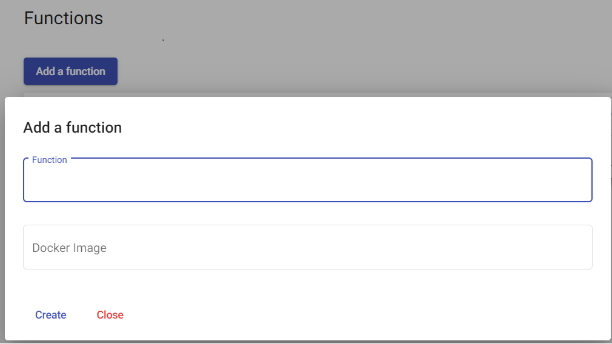

# Manage Functions

> [!WARNING]
> Make sure your working environment is [properly configured](/documentation/gettingstarted/index.html).

A Portal is available at the following [address](http://localhost:30003). It can be used by developers to manage functions.
The following chapters describe how functions can easily be managed.

# Publish a function

> [!WARNING]
> Before publishing a function, it should be available in an online store for example DockerHub. For more information please refer to this [chapter](/documentation/functions/create.html#deploy-a-function).

In the website, click on the `Add a function` button and fill in the form with the following information and click on `Create`.

* **Name** : This parameter is used to uniquely identify a function for example `test`.
* **Image**: Name of the Docker image for example : `simpleidserver/faastransform:0.0.3`.



The function will be published and displayed in the table.


# Unpublish a function

Navigate to the function and click on the `Delete` button present in the `Information` tab.

The function will be unpublished and removed from the table.


# Invoke a function

Navigate to the function and click on the `Invoke` tab.

There are two types of parameter :

* **Configuration parameters** : The content is similar to what can be found in configuration files (web.conf or app.conf) for example : mapping rules between Input and Output fields or ConnectionString.
* **Input parameters** : Input parameters directly passed to the function.

If `faastransform` is published, it can be invoked like this :

* **Output parameters** : Add a new parameter and set the first field value to `firstname`, and specify `FIRSTNAME` in the second field.
* **Input parameter** : Specify the following JSON content.

```
{ "firstname" : "sid" }
```

Click on the `Launch` button. The JSON object above will be transformed into a new object which looks like to something like this :

```
{ "FIRSTNAME": "sid" }
```


# Monitor a function

Navigate to the function and click on the `Monitoring` tab.

There are several panels displayed in the UI. Each of them enable developers to follow the performance of the published function for examples : CPU Usage, Memory Usage or Number of request.

