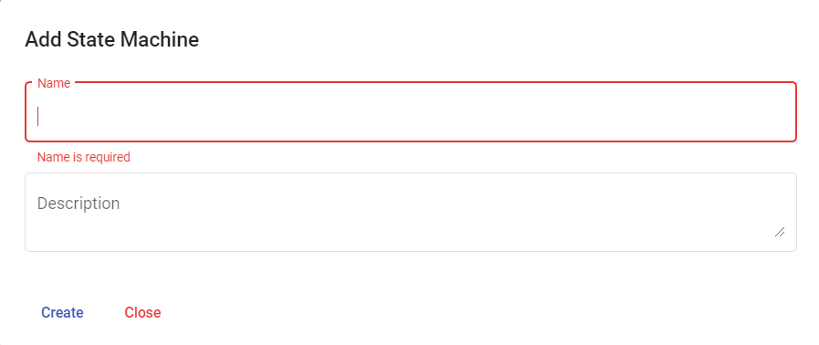
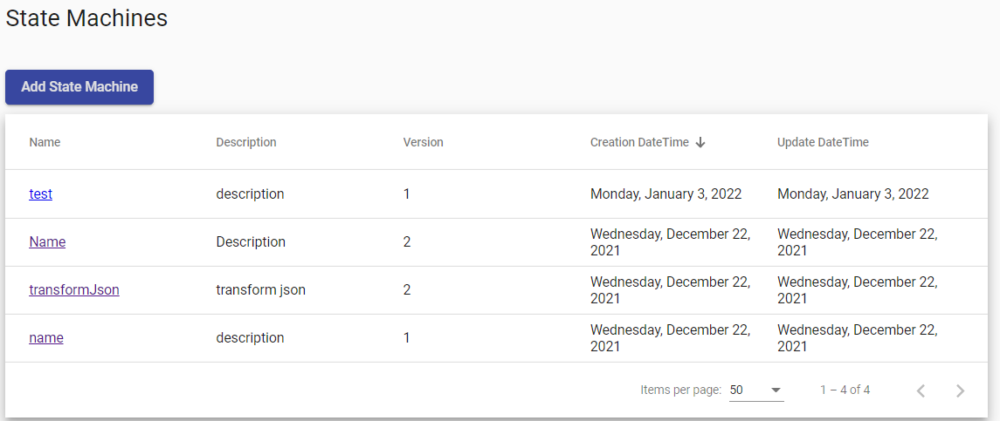

# Hello World workflow

> [!WARNING]
> Make sure your working environment is [properly configured](/documentation/gettingstarted/index.html).

FaasNet project implements the [Serverless Workflow specification](https://github.com/serverlessworkflow/specification/blob/main/specification.md).
Thanks to the web portal, a workflow/state machine can easily be developed and published by any developers.

# Create workflow

In the website, click on the `Add a State Machine` button and fill in the form with the following information and click on `Create` button.

* **Name** : Name of the workflow for example `test`.
* **Description** : Short description.

The state machine will be published and displayed in the table.

# Edit the workflow

In the table, click on the link to edit the workflow. The edition view contains four blocks:

1. Toolbox : States which can be added to the workflow for example : Injection and Switch state.
2. Toolbar : List of possible actions : save workflow, create and launch an instance.
3. Editor : Structure of the workflow.
4. Properties : Properties of the selected state.

# Launch the workflow

Click on the `Launch` button. A popup `Launch State Machine` will be displayed, pass an empty JSON object in the textarea and click on the `Launch` button. If the instance is successfully launched then a successful message will be displayed.

Navigate to the `State Machine instances` view and click on the latest instance displayed in the table.
The UI displays all the incoming and outoing tokens of all the states.

