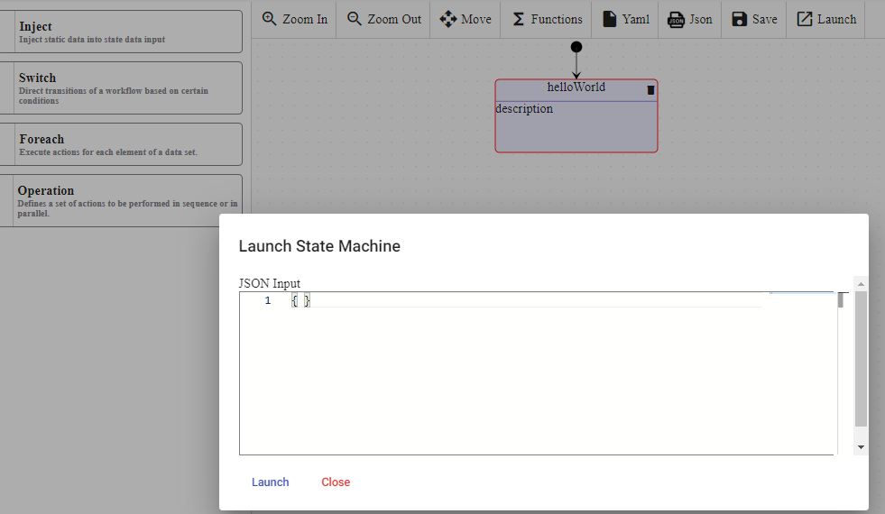
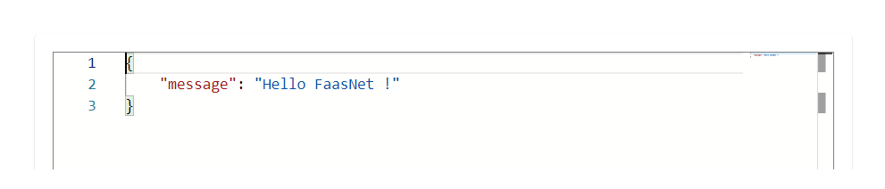

# Inject

> [!WARNING]
> Make sure your working environment is [properly configured](/documentation/gettingstarted/index.html).

Inject state can be added in the workflow, it can be used to inject static data into state data input. It does not perform any action. It is very useful for debugging.

This tutorial explains how to add `Inject state` in a workflow. Before starting, open the [portal](http://localhost:30003/statemachines) and edit a workflow.

## Add Inject state

In the edition view, drag and drop the `Inject state` into the workflow.
Click on the new `Inject state` and set the `Data` property value to `{ "message": "Hello FaasNet" }`.

The workflow must look like this :


YAML file :

```
id: e6efb889-37c1-4c43-b8ed-09a8fe04038f
version: 2
name: InjectState
description: azeaze
start:
  stateName: b2bc152c-cf0c-4854-9802-2abcedfa8ee8
states:
  - id: b2bc152c-cf0c-4854-9802-2abcedfa8ee8
    name: helloWorld
    transition: "null"
    type: inject
    end: true
    data:
      message: Hello FaasNet !
functions: []
```

## Launch the workflow

Click on the `Launch` button. A popup `Launch State Machine` will be displayed, pass an empty JSON object in the textarea and click on the `Launch` button.
If the instance is successfully launched then a successful message will be displayed.



Navigate to the `State Machine instances` view and click on the latest instance displayed in the table. The UI displays all the incoming and outgoing tokens of all the states.

