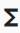
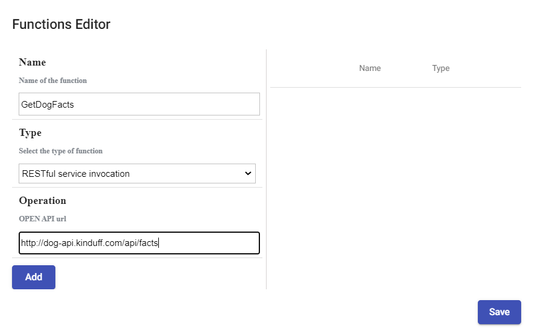
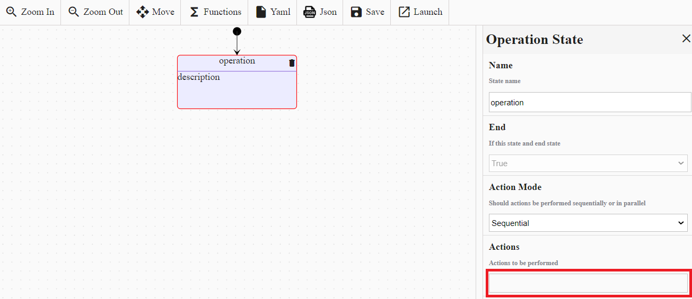
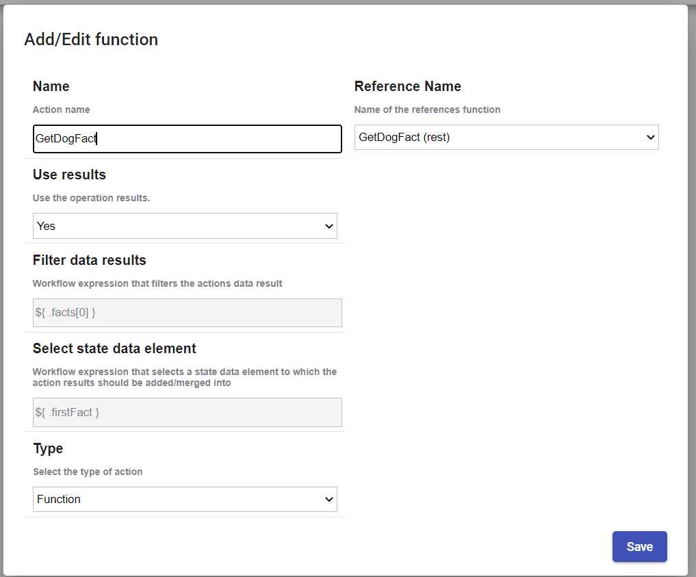
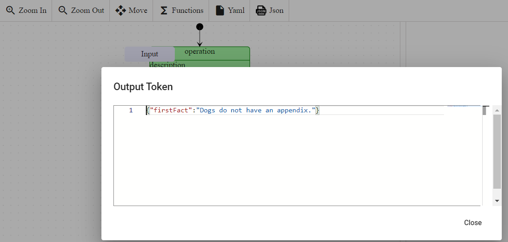

# REST.API call

> [!WARNING]
> Make sure your working environment is [properly configured](/documentation/gettingstarted/index.html).

Operation state can be added in the workflow to execute REST.API call, get the result and apply transformations on it.

This tutorial explains how to make REST.API call in your workflow. Before starting, open the [portal](http://localhost:30003/statemachines) and edit a workflow.

## Add a Workflow function

According to the [Serverless Workflow specification](https://github.com/serverlessworkflow/specification/blob/main/specification.md#workflow-functions), workflow function is a reusable definition for service invocation and/or expression evaluation. 
It can be referenced by its identifier inside the workflow states.

In the workflow edition view, click on the  Functions button. 
A popup will be displayed, fill-in the form like this and click on the `Add` button.
* **Name**: Name of the function for example : `GetDogFacts`.
* **Type**: Select the type of function : `RESTFul service invocation`.
* **Operation**: Enter the API url or the OPENAPI url for example : `http://dog-api.kinduff.com/api/facts`.



## Add an Operation state

Drag and drop the `Operation state` into the workflow. Edit its properties and add a new action by clicking on the text field `Actions to be performed`.



A popup will be displayed, fill-in the form like this and click on the `Add` button.
* **Name** : Name of the action : `GetDogFact`.
* **Use results** : If set to false, action data results are not added/merged to state data. Default must be `true`.
* **Filter data results**: Workflow expression that filters the actions data results for example: `.facts[0]`.
* **Select state data element** Workflow expression that selects a state data element to which the action results should be added/merged into for example : `.firstFact`.
* **Type** : Select the type of action : `Function`.
* **Arguments** : Arguments (input) passed to the referenced function.



## Execute operation

When the workflow is executed :
1. The operation state is going to fetch the result from the API : `{ "facts": ["Dogs do not have an appendix."], "status": true }`.
2. The JSON result is transformed by the `results` expression : the incoming JSON `{ "facts": ["Dogs do not have an appendix."], "status": true }` becomes `"Dogs do not have an appendix."`.
3. The transformed JSON is added into the state data, the destination is specified by the `toStateData` parameter. The state should look like to something like this `{ "firstFact" : "Dogs do not have an appendix." }`.



YAML file :

```
id: 531a4b36-46f5-4406-b77a-1f9c50998668
version: 4
name: GetAllDogFact
description: GetAllDogFact
start:
  stateName: b73b7168-d47c-4c2a-a0ce-0670e14a0aa8
states:
  - id: b73b7168-d47c-4c2a-a0ce-0670e14a0aa8
    name: operation
    type: operation
    actionMode: sequential
    end: true
    actions:
      - name: GetDogFact
        functionRef:
          refName: GetDogFact
        actionDataFilter:
          useResults: true
          results: ${ .facts[0] }
          toStateData: ${ .firstFact }
functions:
  - name: GetDogFact
    type: rest
    operation: http://dog-api.kinduff.com/api/facts
```
 
The workflow definition can be replaced by cliking on the button .