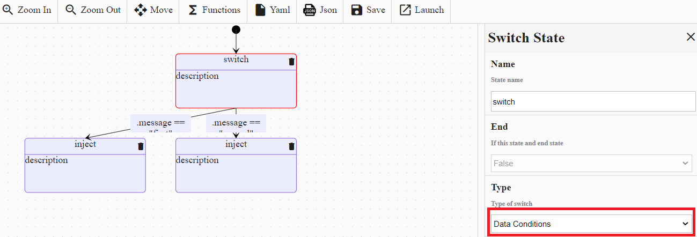
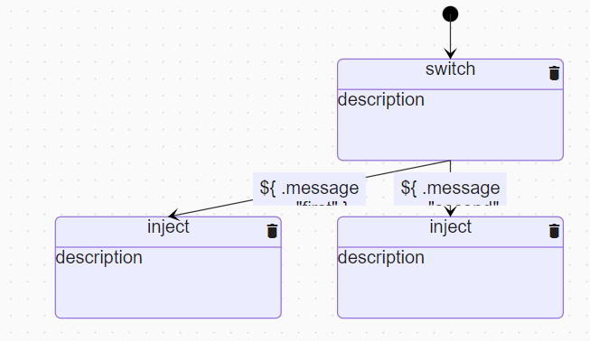
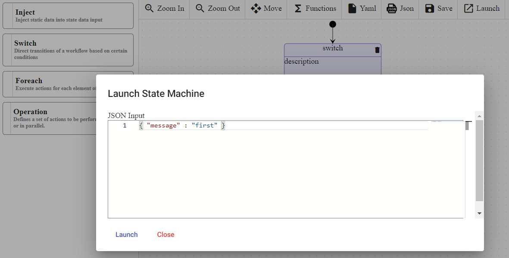
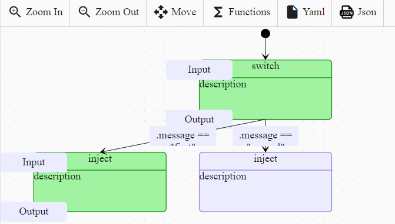

# Switch

> [!WARNING]
> Make sure your working environment is [properly configured](/documentation/gettingstarted/index.html).

Switch state can be added in the workflow, it can be viewed as workflow gateway: they can direct transitions of a workflow based on certain conditions. There are two types of conditions for switch states :
* **Data-based conditions**: cause a transition to another workflow state if evaluated to true.
* **Event-based conditions** : when the referenced event is received then make a transition to an another workflow state.

This tutorial explains how to add `Switch state` in a worklow. Before starting, open the [portal](http://localhost:30003/statemachines) and edit a workflow.

## Add Switch state

In the edition view, drag and drop the `Switch state` into the workflow.
Click on the new `Switch state` and choose the value `Data conditions`.



Add two `Inject state` below the `Switch state` and edit their properties like this :
1. Data property must be equals to `{ "message": "first" }`.
2. Data property must be equals to `{ "message": "second" }`.

Edit the transitions like this :
1. Condition property must be equals to `.message == "first"`.
2. Condition property must be equals to `.message == "second"`.

At the end, the workflow must look like this :



YAML file :

```
id: 268ba6ef-4c30-4d6d-a27e-66c469815adc
version: 2
name: Switch
description: Switch
start:
  stateName: 412ad5ea-05b7-4869-8ebb-fe2a57a11370
states:
  - id: 412ad5ea-05b7-4869-8ebb-fe2a57a11370
    name: switch
    type: switch
    dataConditions:
      - name: null
        transition: f3195bc9-ed40-4e36-bf5b-8a46ea87647d
        condition: ${ .message == "first" }
      - name: null
        transition: b17eef97-0430-424c-a348-8aaee2594beb
        condition: ${ .message == "second" }
  - id: b17eef97-0430-424c-a348-8aaee2594beb
    name: inject
    transition: ""
    type: inject
    end: true
    data:
      message: second
  - id: f3195bc9-ed40-4e36-bf5b-8a46ea87647d
    name: inject
    transition: ""
    type: inject
    end: true
    data:
      message: first
functions: []
```

## Launch the workflow

Click on the `Launch` button. A popup `Launch State Machine` will be displayed, pass the JSON `{ "message" : "first" }` in the textarea and click on the `Launch` button.
If the instance is successfully launched then a successful message will be displayed.



Navigate to the `State Machine instances` view and click on the latest instance displayed in the table. The UI displays all the incoming and outgoing tokens of all the states.

